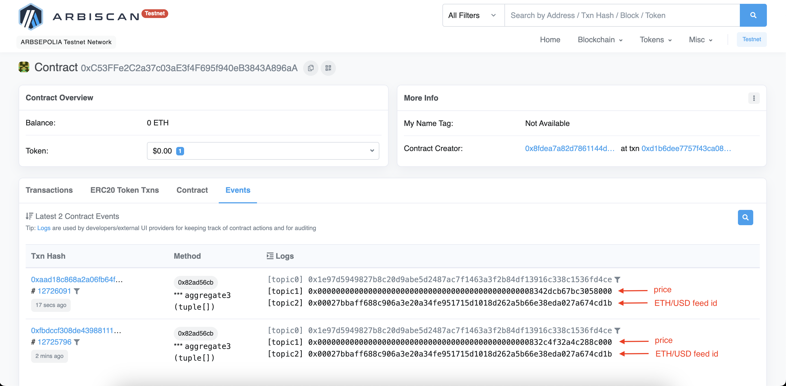

## Chainlink Data Streams - ERC 7412

> **Note**
>
> _This repository represents an example of using a Chainlink product or service. It is provided to help you understand how to interact with Chainlink’s systems so that you can integrate them into your own. This template is provided "AS IS" without warranties of any kind, has not been audited, and may be missing key checks or error handling to make the usage of the product more clear. Take everything in this repository as an example and not something to be copy pasted into a production ready service._

This repository contains the basic implementation of [EIP 7412](https://eips.ethereum.org/EIPS/eip-7412) compatible smart contract using [Chainlink Data Streams](https://docs.chain.link/data-streams).

### What

Below is the sequence diagram of triggering and getting the latest price data from Chainlink Data Streams DON.


### Prerequisites

- [Node.js](https://nodejs.org/en) version 20 or above
- [Foundry](https://book.getfoundry.sh/getting-started/installation) installed
- [Alchemy](https://dashboard.alchemy.com/) API key for Arbitrum Sepolia testnet
- [1 Arbitrum Sepolia LINK](https://faucets.chain.link/arbitrum-sepolia) and some amount of Arbitrum Sepolia ETH (for gas costs)
- Chainlink Data Streams credentials

### Usage

1. Install dependencies:

```
forge install
```

```
npm install
```

2. Compile smart contracts:

```
forge build
```

3. Deploy `DataStreamsERC7412Compatible` smart contract

```
forge create --rpc-url <ARBITRUM_SEPOLIA_RPC_URL> --private-key <DEPLOYER_PRIVATE_KEY> contracts/DataStreamsERC7412Compatible.sol:DataStreamsERC7412Compatible --constructor-args 0x2ff010DEbC1297f19579B4246cad07bd24F2488A
```

The `0x2ff010DEbC1297f19579B4246cad07bd24F2488A` is the address of a Verifier smart contract, to get more details visit [Stream IDs page](https://docs.chain.link/data-streams/stream-ids) at the official Chainlink Documentation.

4. Deploy `Multicall3_1` smart contract

```
forge create --rpc-url <ARBITRUM_SEPOLIA_RPC_URL> --private-key <DEPLOYER_PRIVATE_KEY> contracts/Multicall3_1.sol:Multicall3_1
```

5. Set the following environment variables

```
WALLET_PRIVATE_KEY=
CHAINLINK_CLIENT_ID=
CHAINLINK_CLIENT_SECRET=
CHAINLINK_API_URL=
CHAINLINK_WEBSOCKET_URL=
ALCHEMY_KEY=
DATA_STREAMS_ERC7412_COMPATIBLE_CONTRACT_ADDRESS=
MULTICALL3_1_ADDRESS=
```

6. Fund the `DataStreamsErc7412Compatible` smart contract by transferring at least [1 Arbitrum Sepolia LINK](https://faucets.chain.link/arbitrum-sepolia) to the `DATA_STREAMS_ERC7412_COMPATIBLE_CONTRACT_ADDRESS`, for example from Metamask wallet.

7. Run end-to-end demonstration on Arbitrum Sepolia

```
npm start
```

You will see the URL to the Arbitrum Sepolia block explorer with a transaction hash in the Terminal, for example:

```shell

> start
> npm run compile && node dist/index.js


> compile
> tsc

Transaction hash: https://sepolia.arbiscan.io/tx/0xa6092c573aac7b48330e6a7df824a5fda5193e37b7652b11b18d73b98debf7b1
```

If you repeat the command, and the latest price hasn't expired yet, you will see the log with the latest cached price from the `DataStreamsERC7412Compatible` smart contract, for example:

```shell

> start
> npm run compile && node dist/index.js


> compile
> tsc

Latest price of 0x00027bbaff688c906a3e20a34fe951715d1018d262a5b66e38eda027a674cd1b feed ID: 2419103125435294300000
```

You will see logs with actual prices if you check the `Events` tab of the `DataStreamsErc7412Compatible` smart contract at block explorer at `https://sepolia.arbiscan.io/address/DATA_STREAMS_ERC7412_COMPATIBLE_CONTRACT_ADDRESS#events`, for example


